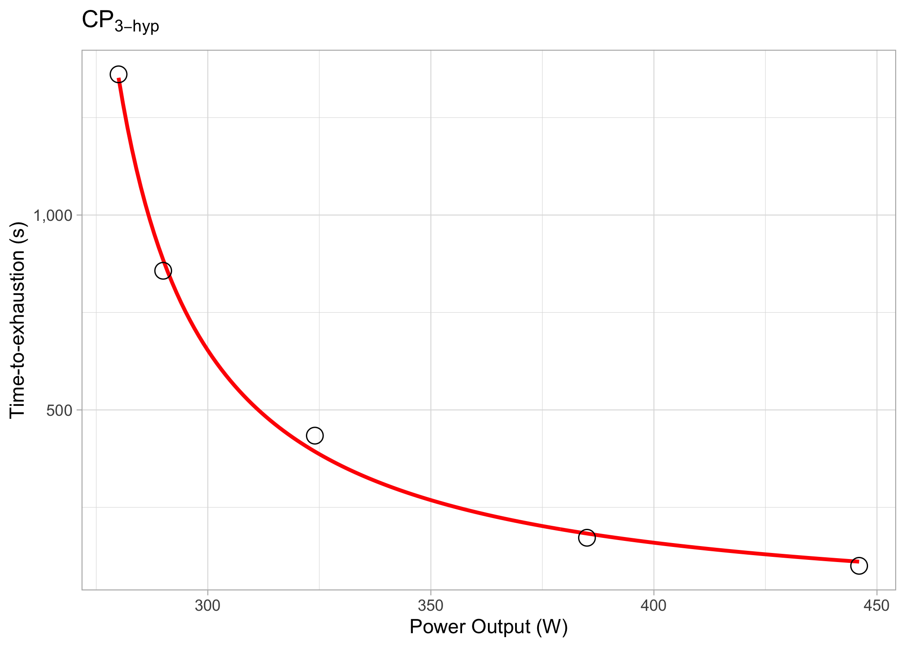

<!-- README.md is generated from README.Rmd. Please edit that file -->

# cyclingtools 

<!-- badges: start -->

[](https://www.tidyverse.org/lifecycle/#maturing)
[](https://CRAN.R-project.org/package=cyclingtools)
[](https://github.com/fmmattioni/cyclingtools/actions)
<!-- badges: end -->

The goal of `cyclingtools` is to provide tools for making easier to
analyze data in cycling.

## Installation

You can install the development version of `cyclingtools` from
[GitHub](https://github.com/fmmattioni/cyclingtools) with:

``` r
# install.packages("remotes")
remotes::install_github("fmmattioni/cyclingtools")
```

## Usage

### Critical Power

#### Demo data

The package comes with a demonstration data frame to show how the
functions work and also to show you how you can setup your data:

``` r
library(cyclingtools)

demo_data
#>    PO  TTE
#> 1 446  100
#> 2 385  172
#> 3 324  434
#> 4 290  857
#> 5 280 1361
```

#### Simple analysis

Perform a simple analysis from the chosen critical power models:

``` r
simple_results <- critical_power(
  .data = demo_data, 
  power_output_column = "PO", 
  time_to_exhaustion_column = "TTE", 
  method = c("3-hyp", "2-hyp", "linear", "1/time"), 
  plot = TRUE, 
  all_combinations = FALSE,
  power_in_y_axis = FALSE
)

simple_results
#> # A tibble: 4 x 12
#>   method data  model    CP `CP SEE`   `W'` `W' SEE`  Pmax `Pmax SEE`    R2
#>   <chr>  <lis> <lis> <dbl>    <dbl>  <dbl>    <dbl> <dbl>      <dbl> <dbl>
#> 1 3-hyp  <tib… <nls>  260.      3.1 27410.    4794  1004.       835. 0.998
#> 2 2-hyp  <tib… <nls>  262.      1.6 24174.    1889.   NA         NA  0.997
#> 3 linear <tib… <lm>   266.      3   20961.    2248.   NA         NA  1.00 
#> 4 1/time <tib… <lm>   274.      6.2 17784.    1160    NA         NA  0.987
#> # … with 2 more variables: RMSE <dbl>, plot <list>
```

You can also plot the results:

``` r
simple_results %>% 
  dplyr::filter(method == "3-hyp") %>% 
  dplyr::pull(plot)
#> [[1]]
```



#### All possible combinations analysis

You can also perform an analysis with all the possible combinations of
time-to-exhaustion trials provided. All you need to do is to set
`all_combinations = TRUE`:

``` r
combinations_results <- critical_power(
  .data = demo_data, 
  power_output_column = "PO", 
  time_to_exhaustion_column = "TTE", 
  method = c("3-hyp", "2-hyp", "linear", "1/time"), 
  plot = TRUE, 
  all_combinations = TRUE,
  power_in_y_axis = FALSE
)

combinations_results
#> # A tibble: 74 x 13
#>    index method data  model    CP `CP SEE`   `W'` `W' SEE`  Pmax `Pmax SEE`
#>    <chr> <chr>  <lis> <lis> <dbl>    <dbl>  <dbl>    <dbl> <dbl>      <dbl>
#>  1 [1,2… 3-hyp  <tib… <nls>  260.      3.1 27410.    4794  1004.      835. 
#>  2 [1,2… 2-hyp  <tib… <nls>  262.      1.6 24174.    1889.   NA        NA  
#>  3 [1,2… linear <tib… <lm>   266.      3   20961.    2248.   NA        NA  
#>  4 [1,2… 1/time <tib… <lm>   274.      6.2 17784.    1160    NA        NA  
#>  5 [1,2… 3-hyp  <tib… <nls>  246.      6.2 42699.    7655   595.       70.2
#>  6 [1,2… 2-hyp  <tib… <nls>  261.      4.7 24814.    3691.   NA        NA  
#>  7 [1,2… linear <tib… <lm>   269.      5.9 19977.    2877.   NA        NA  
#>  8 [1,2… 1/time <tib… <lm>   278.      7.9 17194.    1339.   NA        NA  
#>  9 [1,2… 3-hyp  <tib… <nls>  255       1.9 36462.    3328.  627.       63.7
#> 10 [1,2… 2-hyp  <tib… <nls>  262.      2.2 24940.    2882.   NA        NA  
#> # … with 64 more rows, and 3 more variables: R2 <dbl>, RMSE <dbl>, plot <list>
```

You can also plot the results:

``` r
combinations_results %>% 
  dplyr::slice(1) %>% 
  dplyr::pull(plot)
#> [[1]]
```


### You can also do all of these analyses in our shiny app:

[Critical Power Dashboard](https://www.shiny.fmattioni.me/CPapp/)

## Coming soon

  - Training impulse analyses (iTRIMP, bTRIMP, eTRIMP, luTRIMP)

  - Suggestions? Feel free to open an issue\!

## Related work

[cycleRtools](https://cran.r-project.org/web/packages/cycleRtools/index.html):
A suite of functions for analysing cycling data.

## Citation

``` r
citation("cyclingtools")
#> 
#> Maturana M, Felipe, Fontana, Y F, Pogliaghi, Silvia, Passfield, Louis,
#> Murias, M J (2018). "Critical power: How different protocols and models
#> affect its determination." _Journal of Science and Medicine in Sport_,
#> *21*(7), 1489. doi: 10.1016/j.jsams.2017.11.015 (URL:
#> https://doi.org/10.1016/j.jsams.2017.11.015).
#> 
#> A BibTeX entry for LaTeX users is
#> 
#>   @Article{,
#>     title = {Critical power: How different protocols and models affect its determination},
#>     author = {Mattioni Maturana and {Felipe} and {Fontana} and Federico Y and {Pogliaghi} and {Silvia} and {Passfield} and {Louis} and {Murias} and Juan M},
#>     journal = {Journal of Science and Medicine in Sport},
#>     volume = {21},
#>     number = {7},
#>     pages = {1489},
#>     year = {2018},
#>     publisher = {Elsevier},
#>     doi = {10.1016/j.jsams.2017.11.015},
#>   }
```
